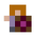
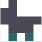
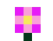

# Virtual World Simulator in Java

This is a Virtual World Simulator written in Java using the Swing library, developed as part of the Object-Oriented Programming course in my second semester at Gdańsk University of Technology.

## Author
- Karolina Glaza [GitHub](https://github.com/kequel)

### Version
- Current version: **1.1**

## Description
The Virtual World Simulator is a turn-based simulation game set on a two-dimensional grid of size NxM, specified by the user. Recommended sizes are 10x10 or larger to fully experience the variety of organisms. The game allows users to save and load their progress, as well as quit at any time. In the virtual world, simple life forms interact according to their predefined behaviors.

### ANIMALS

- **Human/Player**
  
  The player controls the human using arrow keys to move in the desired direction. The human has a special ability called Alzur Shield, which can be activated via a button. This skill lasts for 5 rounds and then has a cooldown period of 5 rounds. While active, Alzur Shield scares away all animals in adjacent fields, moving them to random nearby squares.
  - **Strength:** 5  
  - **Initiative:** 4

      _/with shield:_ 

- **Antelope**
  
  Moves two squares per turn and has a 50% chance to escape combat by moving to an adjacent, unoccupied square.
  - **Strength:** 4  
  - **Initiative:** 4
  
    

- **Fox**

  Only moves to fields where organisms weaker than itself are present, avoiding stronger opponents.
  - **Strength:** 3  
  - **Initiative:** 7
  
     

- **Sheep**

  A simple animal with balanced strength and initiative.
  - **Strength:** 4  
  - **Initiative:** 4
 
     

- **Turtle**

  Moves rarely (25% chance to move). Repels attacks from animals with strength less than 5, forcing the attacker back to its previous position.
  - **Strength:** 2  
  - **Initiative:** 1
 
     

- **Wolf**

  A strong and fast predator with high initiative.
  - **Strength:** 9  
  - **Initiative:** 5
 
     

### PLANTS

- **Grass**  
  A simple plant.
  - **Strength:** 0  

     

- **Guarana**  
  Increases the strength of the animal that consumes it by 3.
  - **Strength:** 0  

     

- **Milkweed**  
  Attempts to spread to nearby fields up to three times per turn.
  - **Strength:** 0
 
     

- **Nightshadeberries**  
  Any animal that consumes this plant dies instantly.
  - **Strength:** 99
 
     

- **Peony**  
  Grants a human the ability to create a new organism (except another human or peony) on any free square they click.
  - **Strength:** 0
 
      

- **Sosnowski's Borscht**  
  Any animal that consumes or comes into contact with this plant dies.
  - **Strength:** 10
 
       

## Rules of the Virtual World:
1. The simulator is turn-based. In each round, all organisms perform actions based on their type. Animals move, while plants remain stationary but may spread.
   
2. The order of actions in a round is determined by the organisms' initiative. If multiple organisms have the same initiative, older organisms move first.

3. The outcome of an encounter between organisms is typically decided by their strength. If two organisms have equal strength, the attacker wins.

4. Plants attempt to spread each round. Animals can reproduce if two individuals of the same species occupy the same square.
